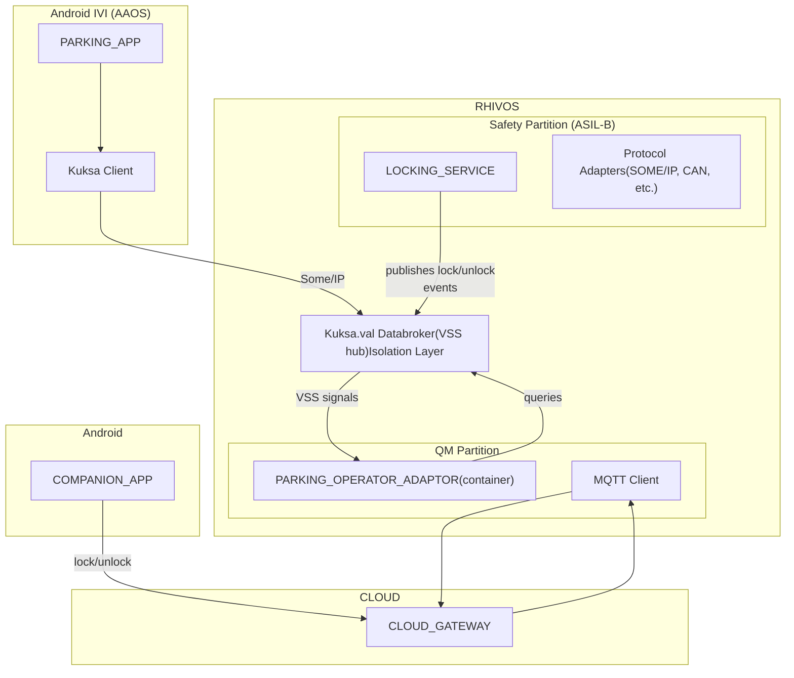

# Abstract

Modern vehicles require communication between safety-critical systems and non-critical applications. This demo shows a working implementation where an Android-based parking payment service communicates with an ASIL-B door locking service running on RHIVOS. The scenario is realistic: automatic parking fee payment starts when the vehicle locks and stops when it unlocks, requiring cross-domain communication between a QM-level Android app and a safety-relevant locking system.

The demo addresses another challenge: how to dynamically provision location-specific services without preloading every possible integration. Parking operators vary by location (city, country), making static deployment impractical. Our implementation uses containerized adapters that download on-demand based on vehicle location, run during the parking session, and offload when unused for 24 hours. This "feature-on-demand" pattern demonstrates how OEMs can enable new services post-production and create additional revenue opportunities through software monetization.

The architecture spans multiple domains: Android IVI for user interaction, RHIVOS safety partition for door locking (ASIL-B), RHIVOS QM partition for operator adapters and cloud infrastructure for adapter distribution and management. Development uses Red Hat OpenShift for cloud-side services and CI/CD pipelines. RHIVOS uses Podman for local container execution, with lifecycle managed by Blue-chi/systemd. OpenShift builds and distributes OCI images; vehicles pull and run them using native RHIVOS tooling.

Attendees will see functioning code demonstrating practical mixed-criticality integration patterns, container deployment to vehicles, and cloud-native SDV development workflows.

# Problem Statement

Parking regulations and payment systems vary significantly by location and PARKING_OPERATOR. Pre-loading the car with all possible PARKING_OPERATOR integrations is impractical due to the dynamic nature of operators and their location-specific requirements. 

The car's PARKING_APP uses location data to find a suitable PARKING_OPERATOR by querying a cloud-based PARKING_FEE_SERVICE. The PARKING_FEE_SERVICE needs a flexible solution to support diverse PARKING_OPERATORs and PARKING_METER systems (physical meters, app-based, pay-by-plate, etc.).

Solution: Dynamic PARKING_OPERATOR_ADAPTORS

The PARKING_APP will utilize flexible PARKING_OPERATOR_ADAPTORS that are loaded into the car on demand. These adaptors will interface with both the car's PARKING_APP and the PARKING_OPERATOR they belong to. The PARKING_FEE_SERVICE acts as a "trusted source" for these PARKING_OPERATOR_ADAPTORS by offering a validated PARKING_OPERATOR_ADAPTORS to the PARKING_APP. Unused adaptors can be offloaded to free up resources on the car, after a certain amount of time.

## Objectives and Benefits

- To enable automatic parking fee payment via the car's IVI system.    
- To eliminate the need for car owners to use multiple, dedicated parking apps.
- To orchestrate interactions with various PARKING_OPERATORs on the user's behalf.
- To provide a flexible and adaptable solution for diverse parking environments.
    

# User Journey

1. Vehicle Arrival: User parks their vehicle at a designated parking spot in a participating zone.
2. Automatic Location Detection: The vehicle's onboard system detects its current location and queries the cloud service to identify the appropriate parking provider adapter for that zone.
3. Adapter Provisioning: The parking adapter specific to that location (e.g., municipal parking authority, private operator) downloads and initializes automatically on the vehicle's system.
4. Parking Session Confirmation: The infotainment (IVI) screen displays: "Parking active - €X.XX/hr" confirming the session has been established and showing the applicable rate.
5. Session Start: User locks the vehicle with their key fob or the car's companion app. This is handled by a door lock service, which publishes the event on the internal message bus. The parking service subscribes to this event and automatically initiate the parking payment session. No physical ticket or app interaction required.
6. Session End: User unlocks the vehicle upon return, automatically stopping the parking session. Payment is processed seamlessly based on actual duration.
7. Resource Management: If the adapter remains unused for 24 hours (vehicle hasn't returned to that parking zone), it's automatically offloaded to optimize storage and system resources.

# What We'll Demonstrate

- **Cross-domain communication**: Android IVI app ↔ ASIL-B door locking service (RHIVOS)
- **Feature-on-demand**: Container-based parking adapters download based on GPS location, offload when unused
- **Multi-domain architecture**:
    - Android Automotive and "normal" Android for user interfaces
    - RHIVOS QM partition for operator adapters
    - RHIVOS non-QM for safety services
    - OpenShift for cloud orchestration
- **Unified development**: Single toolchain (RH Automotive Suite) across Android/IVI, RHIVOS, and cloud components

# Architecture Overview

## Component Placement
1. **Android IVI (QM)**: In-car user interface for parking app
2. **RHIVOS QM Partition**: Dynamic parking operator adapters (containers)
3. **RHIVOS Safety Partition**: ASIL-B door lock service + vehicle signals
4. **Cloud (OpenShift)**: Adapter registry, parking service, CI/CD for development and validation
5. **Mobile Companion App**: Typical Android or iOS app

## Mixed-Criticality Communication Pattern
- ASIL-B services publish safety-relevant events (door lock/unlock)
- QM adapters subscribe to events (read-only access)
- Isolation enforced by RHIVOS partitioning + hypervisor

## Development Workflow (Primary Demo Focus)
1. Develop ASIL-B service with RHAS  tooling (development, validation, tracing)
2. Develop QM adapter as OCI container
3. All apps and services are developed on OpenShift Dev Spaces or in local IDE
4. All build processes use OpenShift pipelines

## Implementation
- RHIVOS services: Rust
- Android apps: Kotlin
- Backend-services: Golang

## Simplified Implementation (Demo Scope)
- Mock payment processing (no real transactions)
- Generic adapter type (demonstrate pattern, not all operators)
- Simulated location (GPS optional)
- Pre-signed adapters (simplified trust chain)
- Bare-minimum UIX for the Android apps

## Communication
- **Android IVI** layer with the PARKING_APP connecting to Kuksa Client
- **RHIVOS** system containing two partitions:
    - **QM Partition** with the Kuksa Databroker and Adaptor
    - **Safety Partition (ASIL-B)** with the Locking Service and Protocol Adapters

### VSS Signals used
- Vehicle.Cabin.Door.Row1.DriverSide.IsLocked (bool) - lock/unlock events 
- Vehicle.CurrentLocation.Latitude (double) - for zone detection 
- Vehicle.CurrentLocation.Longitude (double) - for zone detection 
- Custom: Vehicle.Parking.SessionActive (bool) - adapter-managed state

# Components

#### PARKING_APP
- Android Automotive OS application running in the vehicle's IVI
- Provides user interface for parking sessions
- Queries PARKING_FEE_SERVICE for available operators
- Triggers adapter downloads
- Displays session status to the driver

#### PARKING_OPERATOR_ADAPTOR
- Containerized application running in the RHIVOS QM partition
- Implements a common interface towards the PARKING_APP
- Implements a proprietary interface towards its PARKING_OPERATOR

#### LOCKING_SERVICE
- Runs in the RHIVOS safety-partition
- Interacts with actors that can initiate locking/unlocking of the car (e.g., key fob, COMPANION_APP)
- Validates safety constraints (e.g., vehicle velocity, door ajar status) before executing lock/unlock commands
- Note: For this demo, focuses on stationary vehicle scenarios where velocity checks are trivial

#### PARKING_FEE_SERVICE
- Cloud-based service providing:
    - REST API for parking session management
    - OCI Container Registry (REGISTRY) for validated PARKING_OPERATOR_ADAPTORs
    - Operator validation and approval workflow (out-of-scope)
- REGISTRY
	- Container registry managed by the PARKING_FEE_SERVICE operator

#### COMPANION_APP
- Mobile app (Android, iOS)
- Allows querying the car's state
- Issues commands to the car remotely (e.g., locking/unlocking)
